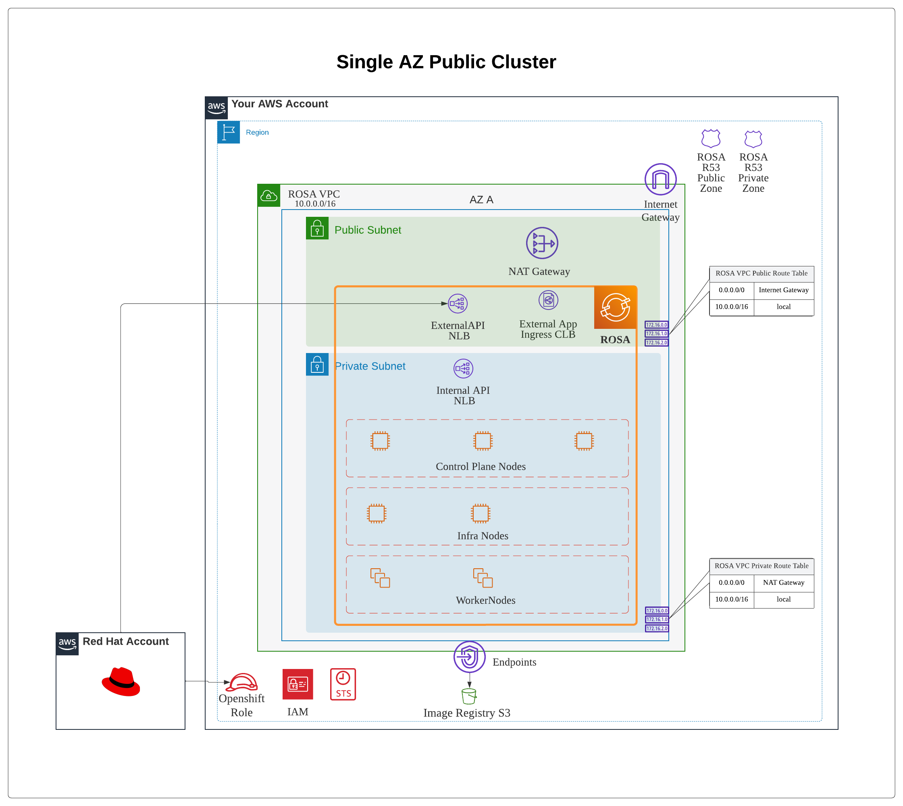
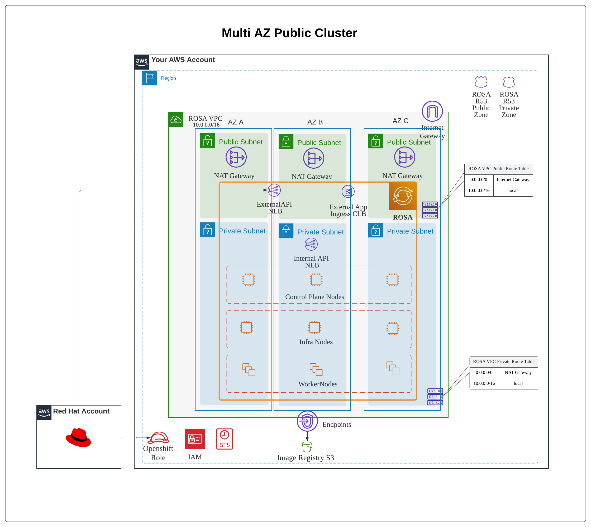
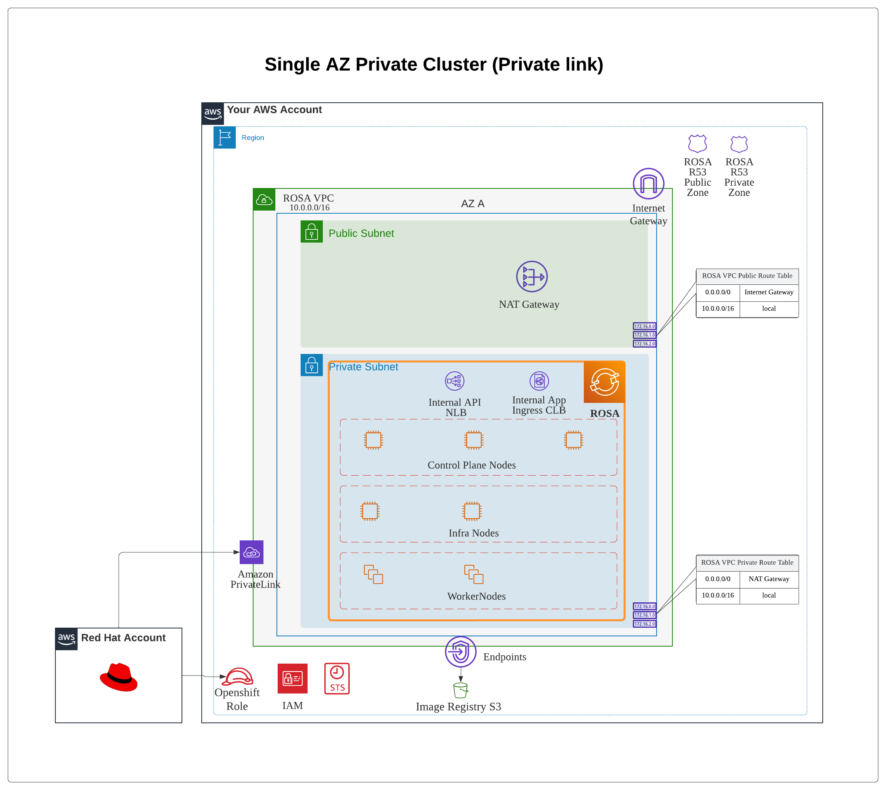
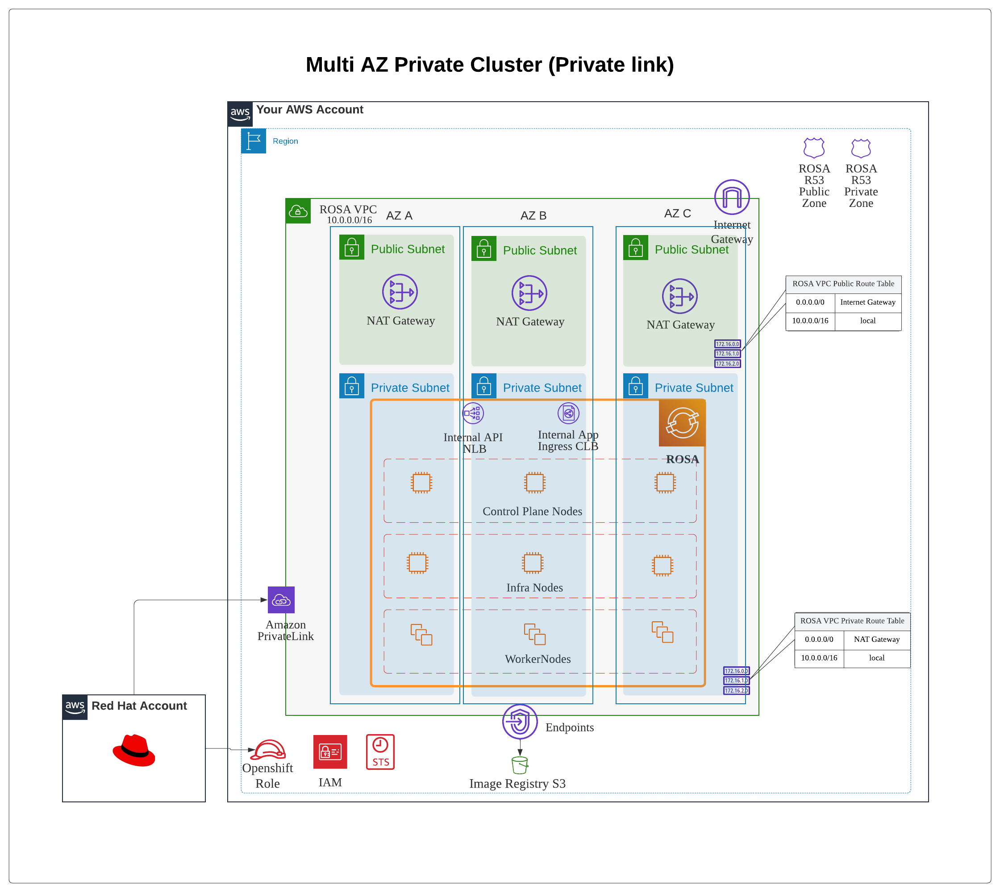
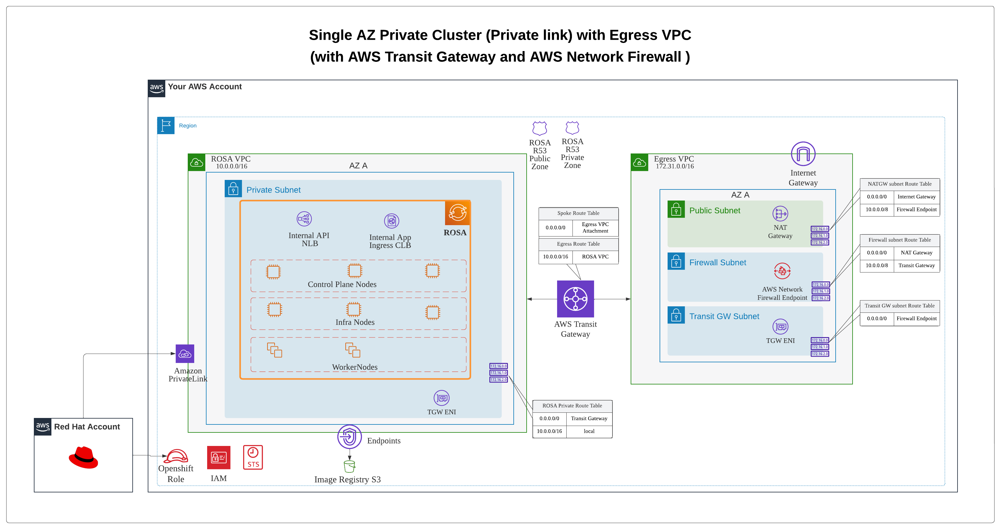
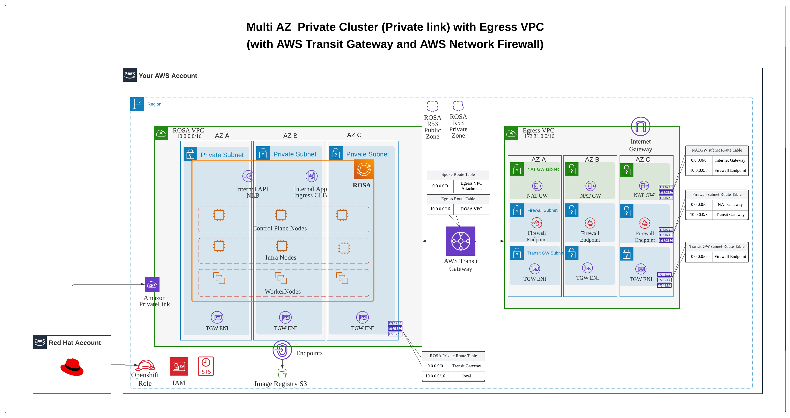
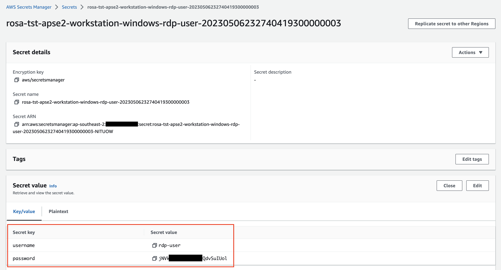

```
IMPORTANT NOTE: This site is not official Red Hat documentation and is provided for informational purposes only. These guides and the scripts provided may be experimental, proof of concept, or early adoption. Please test and verify before deploying anyhting to production. Officially supported documentation is available at docs.openshift.com and access.redhat.com.
```

# ROSA Terraform Deployement


## Account Preparation
The below tasks are one time task to be performed on your AWS account to provide necessary permission to link your Redhat account to AWS.

<details style="margin-left: 20px">
<summary>Details</summary>

* ### Install the required tools

rosa cli : Refer the [link](https://docs.openshift.com/rosa/rosa_cli/rosa-get-started-cli.html) to install rosa cli.

jq: Refer the [link](https://stedolan.github.io/jq/download/) to install jq.

Terraform: Refer the [link](https://developer.hashicorp.com/terraform/tutorials/aws-get-started/install-cli) to install terraform.

aws cli: Refer the [link](https://docs.aws.amazon.com/cli/latest/userguide/getting-started-install.html) to install aws cli.

* ### Generate to ROSA Offile Access Token

The token can be obtainer from the [link](https://console.redhat.com/openshift/token/rosa). Login using your Red Hat account.

test the token using the below command

```
export ROSA_OFFLINE_TOKEN=<token value>
rosa login --token=$ROSA_OFFLINE_TOKEN
```

if successfull you should see the below
`I: Logged in as '<Red Hat user>' on 'https://api.openshift.com'`

* ### Create Openshift Cluster Manger role 

Openshift Cluster Manger role grants the required permissions for installation of ROSA clusters in OpenShift Cluster Manager. And links your 
Red Hat and the AWS Account 

run the below command to create the [ocm-role](https://docs.openshift.com/rosa/rosa_architecture/rosa-sts-about-iam-resources.html#rosa-sts-understanding-ocm-role_rosa-sts-about-iam-resources)

`rosa create ocm-role --mode auto`

* ### Clone this repo

Clone the repo

`git clone https://github.com/Manoj2087/rosa-terraform.git`

* ### Configure AWS Credentials for Terraforrm AWS provider

There are several ways to authenticate against AWS for your Terraform provider, more info refer [link](https://registry.terraform.io/providers/hashicorp/aws/latest/docs#authentication-and-configuration)

#### Using AWS Cli 
This is the simplest way for testing. Make sure the user has necessary IAM policy to perform the deployment in your AWS account 

```
Note: for testing you can assign the user `AdministratorAccess` policy
```

```
aws configure
```

pass the AWS Access Key ID, AWS Secret Access Key and Default region name


</details>

---
---

## Deploy ROSA Cluster

ROSA cluster can be deployed using different modes to support High availability and in different AWS network architecture to support you network security requirements. 

### Supported ROSA deployement Architecture

1. Single AZ/Multi AZ Public Cluster

<details style="margin-left: 20px">
<summary>Details</summary>

**To deploy** `Single AZ Public Cluster`
<details style="margin-left: 30px">
<summary>Details</summary>



```
export ROSA_OFFLINE_TOKEN="<update rosa token value>"
export TRANSIT_GATEWAY_ID=""
cd 02-rosa-cluster
sed -e "s/@@rosa-token@@/$ROSA_OFFLINE_TOKEN/" \
  -e "s/@@multiaz@@/false/" \
  -e "s/@@private-cluster@@/false/" \
  -e "s/@@transitgw-used@@/false/" \
  -e "s/@@transitgw-id@@/$TRANSIT_GATEWAY_ID/" \
  -e "s/@@deploy-workstation@@/false/" \
  variable.auto.tfvars.sample \
  > variable.auto.tfvars
terraform init
terraform plan
terraform apply -auto-approve
cd ..
```
</details>

---

**To deploy** `Multi AZ Public Cluster`

<details style="margin-left: 30px">
<summary>Details</summary>



```
export ROSA_OFFLINE_TOKEN="<update rosa token value>"
export TRANSIT_GATEWAY_ID=""
cd 02-rosa-cluster
sed -e "s/@@rosa-token@@/$ROSA_OFFLINE_TOKEN/" \
  -e "s/@@multiaz@@/true/" \
  -e "s/@@private-cluster@@/false/" \
  -e "s/@@transitgw-used@@/false/" \
  -e "s/@@transitgw-id@@/$TRANSIT_GATEWAY_ID/" \
  -e "s/@@deploy-workstation@@/false/" \
  variable.auto.tfvars.sample \
  > variable.auto.tfvars
terraform init
terraform plan
terraform apply -auto-approve
cd ..
```
</details>

---

**To access the console** `Single AZ/Multi AZ Public Cluster`, 

<details style="margin-left: 30px">
<summary>Details</summary>

refer the console url from the terraform output. 

```
cd 02-rosa-cluster
terraform output -json | jq .rosa_console_url.value.url -r
cd ..
```
</details>

---

**To delete** `Single AZ/Multi AZ Public Cluster`

<details style="margin-left: 30px">
<summary>Details</summary>

```
cd 02-rosa-cluster
terraform plan -destroy
terraform apply -destroy -auto-approve
cd ..
```
</details>

---

</details>

---

2. Single AZ/Multi AZ Private Cluster (Private link)

<details style="margin-left: 20px">
<summary>Details</summary>

**To deploy** `Single AZ Private Cluster (Private link)`
<details style="margin-left: 30px">
<summary>Details</summary>



```
export ROSA_OFFLINE_TOKEN="<update rosa token value>"
export TRANSIT_GATEWAY_ID=""
cd 02-rosa-cluster
sed -e "s/@@rosa-token@@/$ROSA_OFFLINE_TOKEN/" \
  -e "s/@@multiaz@@/false/" \
  -e "s/@@private-cluster@@/true/" \
  -e "s/@@transitgw-used@@/false/" \
  -e "s/@@transitgw-id@@/$TRANSIT_GATEWAY_ID/" \
  -e "s/@@deploy-workstation@@/true/" \
  variable.auto.tfvars.sample \
  > variable.auto.tfvars
terraform init
terraform plan
terraform apply -auto-approve
cd ..
```
</details>

---

**To deploy** `Multi AZ Private Cluster (Private link)`

<details style="margin-left: 30px">
<summary>Details</summary>



```
export ROSA_OFFLINE_TOKEN="<update rosa token value>"
export TRANSIT_GATEWAY_ID=""
cd 02-rosa-cluster
sed -e "s/@@rosa-token@@/$ROSA_OFFLINE_TOKEN/" \
  -e "s/@@multiaz@@/true/" \
  -e "s/@@private-cluster@@/true/" \
  -e "s/@@transitgw-used@@/false/" \
  -e "s/@@transitgw-id@@/$TRANSIT_GATEWAY_ID/" \
  -e "s/@@deploy-workstation@@/true/" \
  variable.auto.tfvars.sample \
  > variable.auto.tfvars
terraform init
terraform plan
terraform apply -auto-approve
cd ..
```
</details>

---

**To access the console** `Single AZ/Multi AZ Private Cluster (Private link)`, 

<details style="margin-left: 30px">
<summary>Details</summary>

refer the console url from the terraform output. 

```
cd 02-rosa-cluster
terraform output -json | jq .rosa_console_url.value.url -r
cd ..
```

```
Note: Since the ROSA API and Console are only accessable internally, but setting the `DEPLOY_WORKSTATION` variable in the `variable.auto.tfvars` file, this also deploys a Linux Workstation (to use `oc cli`) and a windows Workstation (to use the console) in the ROSA VPC Private Subnet.
```
</details>

---

**To delete** `Single AZ/Multi AZ Private Cluster (Private link)`

<details style="margin-left: 30px">
<summary>Details</summary>

```
cd 02-rosa-cluster
terraform plan -destroy
terraform apply -destroy -auto-approve
cd ..
```
</details>

---

</details>

---

3. Single AZ/Multi AZ Private Cluster (Private link) with Egress VPC (via AWS Transit Gateway)

<details style="margin-left: 20px">
<summary>Details</summary>

**To deploy** `Single AZ Private Cluster (Private link) with Egress VPC (via AWS Transit Gateway)`
<details style="margin-left: 30px">
<summary>Details</summary>



Deploy the Egress VPC 

`Note: Skip this deployment of Egress VPC step and continue with Deploy the cluster if your environment already has a Egress VPC with Transit Gateway setup`

```

cd 01-ingress-network
terraform init
terraform plan
terraform apply -auto-approve
terraform output -json | jq .transit_gateway_id.value -r
cd ..
```

Deploy the cluster

```

export ROSA_OFFLINE_TOKEN="<update rosa token value>"
export TRANSIT_GATEWAY_ID="<update Transit GW value>"
cd 02-rosa-cluster
sed -e "s/@@rosa-token@@/$ROSA_OFFLINE_TOKEN/" \
  -e "s/@@multiaz@@/false/" \
  -e "s/@@private-cluster@@/true/" \
  -e "s/@@transitgw-used@@/true/" \
  -e "s/@@transitgw-id@@/$TRANSIT_GATEWAY_ID/" \
  -e "s/@@deploy-workstation@@/true/" \
  variable.auto.tfvars.sample \
  > variable.auto.tfvars
terraform init
terraform plan
terraform apply -auto-approve
cd ..
```
</details>

---

**To deploy** `Multi AZ Private Cluster (Private link) with Egress VPC (via AWS Transit Gateway)`

<details style="margin-left: 30px">
<summary>Details</summary>



Deploy the Egress VPC 

`Note: Skip this deployment of Egress VPC step and continue with Deploy the cluster if your environment already has a Egress VPC with Transit Gateway setup`

```
cd 01-ingress-network
terraform init
terraform plan
terraform apply -auto-approve
terraform output -json | jq .transit_gateway_id.value -r
cd ..
```

Deploy the cluster

```
export ROSA_OFFLINE_TOKEN="<update rosa token value>"
export TRANSIT_GATEWAY_ID="<update Transit GW value>"
cd 02-rosa-cluster
sed -e "s/@@rosa-token@@/$ROSA_OFFLINE_TOKEN/" \
  -e "s/@@multiaz@@/true/" \
  -e "s/@@private-cluster@@/true/" \
  -e "s/@@transitgw-used@@/true/" \
  -e "s/@@transitgw-id@@/$TRANSIT_GATEWAY_ID/" \
  -e "s/@@deploy-workstation@@/true/" \
  variable.auto.tfvars.sample \
  > variable.auto.tfvars
terraform init
terraform plan
terraform apply -auto-approve
cd ..
```
</details>

---

**To access the console** `Single AZ/Multi AZ Private Cluster (Private link) with Egress VPC (via AWS Transit Gateway)` 

<details style="margin-left: 30px">
<summary>Details</summary>

refer the console url from the terraform output. 

```
cd 02-rosa-cluster
terraform output -json | jq .rosa_console_url.value.url -r
cd ..
```

```
Note: Since the ROSA API and Console are only accessable internally, but setting the `DEPLOY_WORKSTATION` variable in the `variable.auto.tfvars` file, this also deploys a Linux Workstation (to use `oc cli`) and a windows Workstation (to use the console) in the ROSA VPC Private Subnet.
```
</details>

---

**To delete** `Single AZ/Multi AZ Private Cluster (Private link) with Egress VPC (via AWS Transit Gateway)`

<details style="margin-left: 30px">
<summary>Details</summary>

Delete the cluster 

```
cd 02-rosa-cluster
terraform plan -destroy
terraform apply -destroy -auto-approve
cd ..
```
Delete the Egress VPC 

`Note: Skip this delete of Egress VPC step if your environment already has a Egress VPC with Transit Gateway setup`

```
cd 01-ingress-network
terraform plan -destroy
terraform apply -destroy -auto-approve
cd ..
```

</details>

---

</details>

---


## Troubleshooting

<details style="margin-left: 20px">
<summary>Details</summary>

### How to RDP into the Windows Workstation deployed in the Private network

<details style="margin-left: 30px">
<summary>Details</summary>

If you deploy the cluster as as private cluster. In order, to access the ROSA console, you might need a workstation with a browser within your private network. 

To facilate this, as part of the Terraform deployment if the `DEPLOY_WORKSTATION` is set to true in the `02-rosa-cluster/variable.auto.tfvars` file, this will deploy a Windows worksation which will be configured with the an RDP enabled user `rdp-user`. The password for this user is stored in the AWS secrets manager as name `<cluster-prefix>-<env>-<region-short>-workstation-windows-rdp-user-<random-number>`

Example,



You can then use the AWS Systems Manager Fleet Manager - remote desktop using the `User credentials` authentication method with the abve retreived user name and password. For more information refer [link](https://docs.aws.amazon.com/systems-manager/latest/userguide/fleet-rdp.html#fleet-rdp-connect-to-node)

</details>

### How to ssh into the Linux Workstation deployed in the Private network

<details style="margin-left: 30px">
<summary>Details</summary>

If you deploy the cluster as as private cluster. In order, to access the ROSA api or use oc cli, you might need a linux workstation within your private network. 

To facilate this, as part of the Terraform deployment if the `DEPLOY_WORKSTATION` is set to true in the `02-rosa-cluster/variable.auto.tfvars` file, this will deploy a Linux worksation. 

You can use the AWS Systems Manager Fleet Manager to start a terminal connection.

</details>

### Logs for creating or deletion of rosa cluster

<details style="margin-left: 30px">
<summary>Details</summary>

The error logs for the creation and deletion of rosa cluster are pushed to the below location

`$HOME/.terraform-rosa/logs/create-rosa-cluster`

`$HOME/.terraform-rosa/logs/delete-rosa-cluster`

</details>

### Issues with creating or deletion of rosa cluster

<details style="margin-left: 30px">
<summary>Details</summary>

If there is issue with the creation or deletion to get detailed error set `debug = true`

update `main.tf`

````
resource "shell_script" "rosa_cluster" {
  lifecycle_commands {
    create = templatefile("${path.module}/script-templates/create-cluster.tftpl",
        {
          ..
          ..
          debug = true
          ..
          ..
        }
    )
    read = templatefile("${path.module}/script-templates/read-cluster.tftpl",
        {
          ..
          ..
          debug = true
          ..
          ..
        }
    )
    # update = file("${path.module}/scripts/update.sh")
    delete = templatefile("${path.module}/script-templates/delete-cluster.tftpl",
        {
          ..
          ..
          debug = true
          ..
          ..
        }
    )
  }

  environment = {}

  sensitive_environment = {
    ROSA_OFFLINE_ACCESS_TOKEN = var.ROSA_TOKEN
  }

  interpreter = ["/bin/bash", "-c"]
}
````
</details>

</details>

### Future Enhancement
1. Egress vpc AWS Firewall support
1. Network Debug flag deploy a debug machine
1. Use ROSA_TOKEN env var to rosa cli login - done